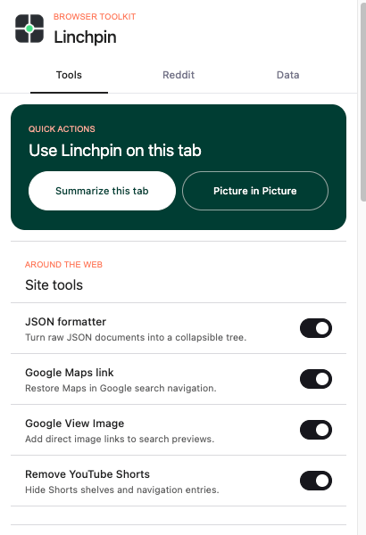

# Linchpin

**A lightweight personal browser toolkit for Reddit, search, media, JSON, and AI summaries.**


Linchpin is a Manifest V3 extension for Chromium browsers and Firefox, built with [WXT](https://wxt.dev). It keeps ambient work site-scoped and event-driven; PiP and page summarization run only after a user action.

Linchpin is not affiliated with Reddit, Google, YouTube, RES, Callum Locke, or any AI provider.

## Screenshot



## Features

| Area         | Features                                                                                                                                                                                                                 |
| ------------ | ------------------------------------------------------------------------------------------------------------------------------------------------------------------------------------------------------------------------ |
| Reddit       | User tags and ignore rules, account switching, bounded old-Reddit infinite scroll, subreddit visit hints, and new-comment counts                                                                                         |
| JSON         | Automatic detection, an initially expanded tree with individual-node collapse, clickable links, raw/formatted views, copy, theme selection, array-index and item-count controls, and unsafe-integer warnings             |
| Google       | Restored Maps search tab and a View Image action on Google Images                                                                                                                                                        |
| YouTube      | Optional CSS-first Shorts removal and `/shorts/…` to `/watch?v=…` conversion                                                                                                                                             |
| Media        | User-triggered native Picture-in-Picture for the most useful visible video                                                                                                                                               |
| AI summaries | User-triggered article extraction and Markdown summaries using OpenAI, Anthropic, xAI, Kimi, Gemini, GLM, or OpenRouter; per-format defaults, one-time model overrides, language control, and rich-text or Markdown copy |

## Install

Grab the latest build from the [GitHub Releases](https://github.com/CicerBro/Linchpin/releases/latest) page (`linchpin-*-chrome.zip` or `linchpin-*-firefox.zip`) and unzip it.

**Chromium (Chrome, Brave, Edge, …):** open `chrome://extensions` (or `brave://extensions` / `edge://extensions`), turn on **Developer mode**, choose **Load unpacked**, and select the unzipped folder.

**Firefox:** open `about:debugging#/runtime/this-firefox`, choose **Load Temporary Add-on…**, and select `manifest.json` inside the unzipped folder. Temporary add-ons are removed when Firefox exits.

## Build

```bash
npm install
npm run build
```

Load `dist/chrome-mv3` the same way as above (Developer mode → Load unpacked).

For Firefox:

```bash
npm run build:firefox
```

Load `dist/firefox-mv3/manifest.json` from `about:debugging#/runtime/this-firefox`.

## Privacy and permissions

- `storage` holds settings, Reddit data, provider configuration, and locally saved account sessions.
- `cookies` plus Reddit host access power the existing account switcher.
- `tabs`, `activeTab`, and `scripting` support current-tab metadata and user-triggered PiP or summary extraction.
- The tiny JSON content script matches general web pages because response pages can use any origin. Its ordinary-HTML path exits after cheap detection checks and it installs no observer after formatting.
- Google and YouTube scripts match only their own supported hosts.
- AI provider origins are optional permissions. Linchpin requests access when a configured provider needs it.

No analytics, telemetry, cloud account, remote configuration, summary history, or background polling is included.

API keys, Reddit cookies, and TOTP secrets are stored only in extension-local storage. That storage is not strong encryption: anyone who can inspect the browser profile may be able to read it. Secrets are excluded from normal Linchpin exports, and Linchpin does not log authorization headers or extracted page text.

## Using tab summaries

1. Configure a provider and API key in the popup. Linchpin loads compatible models and lets you choose separate defaults for **Brief**, **Bullets**, and **Detailed** summaries.
2. Open the page to summarize and choose **Summarize this tab**.
3. Review the extracted title, site, language, and text length. Use the saved defaults or make a one-time provider/model override without changing them.
4. Choose **Brief**, **Bullets**, or **Detailed**. Optionally request English, Dutch, Portuguese, Spanish, German, or Russian; otherwise Linchpin follows the article language.
5. The provider returns GitHub-Flavored Markdown, which Linchpin sanitizes and renders. Copy it as rich text for documents and chat apps, or as the original Markdown.

Extraction injects Mozilla Readability only after the user requests a summary and runs it against a clone of the live document. It falls back to Schema.org articleBody, selected text, article, main, or bounded visible body text. Extracted content is sent as plain text, capped at about 80,000 characters, treated as untrusted input, and never given browser tools. Summary requests use a low temperature (0.3) to keep results grounded and factual.

## Reddit account switching

Linchpin can capture Reddit cookies for a named local account and later swap them back. An optional Base32 TOTP secret can generate a login code when a captured session expires. Account switches are serialized so popup and in-page controls cannot interleave cookie changes; partial failures are reported for manual recovery.

These values are sensitive. Do not commit cookie dumps or TOTP secrets, and recapture a session after completing a manual recovery.

## Import and export

The popup **Data** tab accepts Linchpin backups and RES-style tag JSON. Imported entries are validated individually: usernames, labels, colors, links, numeric votes, timestamps, visit maps, and settings must have supported shapes and bounded values. Tag links must use HTTP(S), and colors must be valid CSS colors without markup.

Normal exports include settings (with summarizer provider and per-style models) plus Reddit data nested under `reddit`:

- `reddit.users`: labels, ignore rules, links, and vote counts
- `reddit.subredditVisits` / `reddit.threadVisits`: visit history

Account cookies, TOTP secrets, and provider API keys are always excluded.

### Chromium RES seed (Chrome / Brave / Edge, …)

Linchpin cannot read another extension’s `storage.local`. On Chromium builds, the Data tab can load a **bundled seed** of RES user tags that you generate on your machine with a Node script (not available in the Firefox build).

With RES installed in a Chromium browser, close that browser (or at least quit it so LevelDB is unlocked), then from the repo:

```bash
npm install
npm run export:res-tags
```

That reads RES’s LevelDB under the browser profile, writes `data/res-tags-seed.json`, and copies it to `public/data/res-tags-seed.json` for packaging. Useful options:

```bash
npm run export:res-tags -- --list                 # find RES installs
npm run export:res-tags -- --browser chrome
npm run export:res-tags -- --browser brave --labeled-only
npm run export:res-tags -- --help
```

Rebuild afterward (`npm run build`) so the seed is included in `dist`. Firefox RES storage uses a different on-disk format; for Firefox, export tags from RES itself and paste/import the JSON in the Data tab.

Visit histories are pruned during startup/writes, never by a timer: threads keep the 5,000 most recent entries and subreddits keep 2,000. Old-Reddit infinite scroll stops after 20 fetched pages or 500 appended posts and provides a normal next-page link.

## Performance model

- No polling timers in ordinary content scripts.
- Reddit and Google mutations are deduplicated and flushed at most once per animation frame, with a microtask fallback for hidden tabs.
- Features have explicit start/stop cleanup and only the changed feature is restarted.
- Site scripts process added subtrees instead of repeatedly scanning the full document.
- YouTube removal is CSS-first.
- PiP and summary extraction install no persistent all-page observers.
- JSON input is limited to 10 MB. The tree starts expanded, while individual child branches are materialized on demand and can be collapsed independently.

## Development

```bash
npm run compile
npm run build
npm run build:firefox
npm run zip
npm run zip:firefox
```

Inspect the generated Chromium and Firefox manifests after permission or entrypoint changes. The implementation intentionally uses plain TypeScript and DOM APIs rather than a popup framework or full AI SDK.

## Third-party code

The JSON formatter adapts runtime behavior from Callum Locke’s json-formatter v0.8.0 (27aa995) under the BSD-3-Clause license. See [the formatter notices](lib/jsonFormatter/THIRD_PARTY_NOTICES.md) and source headers for attribution and Linchpin-specific changes. Mozilla Readability is used only during user-triggered summary extraction under its Apache-2.0 license. marked renders provider Markdown and DOMPurify sanitizes that rendered HTML before it is displayed or copied as rich text.

Linchpin's original code remains under the [WTFPL](LICENSE.md).
